# Tour Companion

A branded, multi-group event companion app for a multi-city sporting tour. Delegates enter
their unique tour code, unlock their group's itinerary, and see exactly what happens next -
day-by-day plans, hotels and transfers, match details, a map, live staff updates, and an
offline-ready profile.

Built with **Flutter + Riverpod**. Designed first in Google Stitch (see `design/`), then built
screen-for-screen to match. Runs fully on a simulator with mock data and no backend.

<p align="center">
  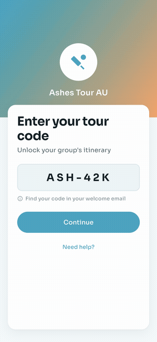
</p>

## What it shows

- **Tour-code access** - a delegate types their code (`ASH-42K`) to unlock only their group's
  content. Six tour groups, each with its own itinerary.
- **"What's next?" home** - a focal hero card for the next event with countdown and meeting
  point, plus today's timeline.
- **Day-by-day itinerary** - day chips + cards with done / today / upcoming status, drilling
  into a full daily schedule.
- **Match & activity detail** - logistics, meeting point, seat/section, what-to-bring, map
  preview, add to calendar.
- **Hotels, transfers & meeting points** - a segmented reference for the whole trip.
- **Maps & directions** - tour points pinned on a stylised map with a directions sheet.
- **Updates** - staff push announcements with a pinned item, unread badge, and an empty state.
- **Delegate profile** - offline-itinerary and push toggles, dietary and emergency details.

## Screens

| Tour code | Welcome | Home |
|---|---|---|
| 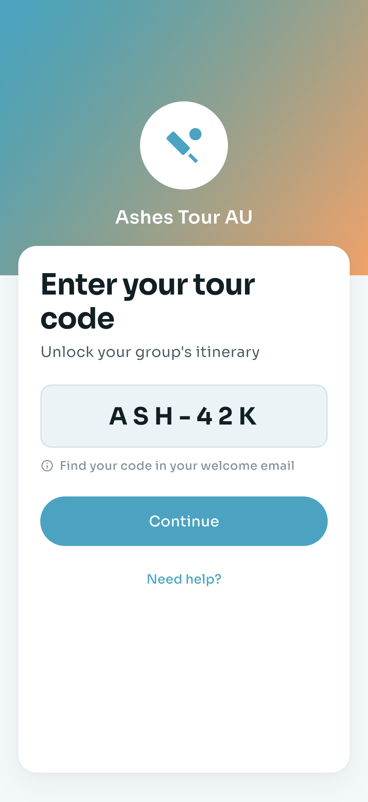 | 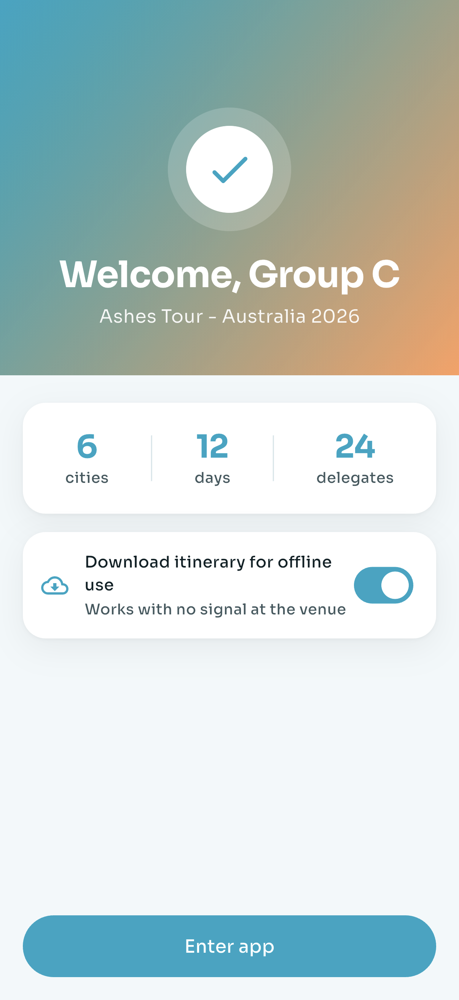 | 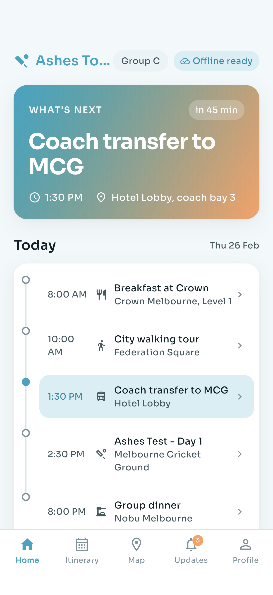 |

| Itinerary | Day detail | Activity detail |
|---|---|---|
| 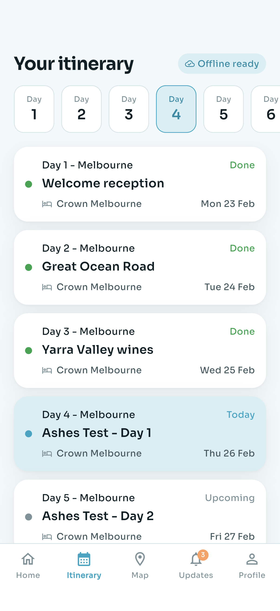 | 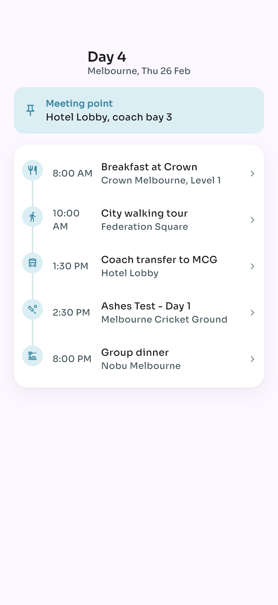 | 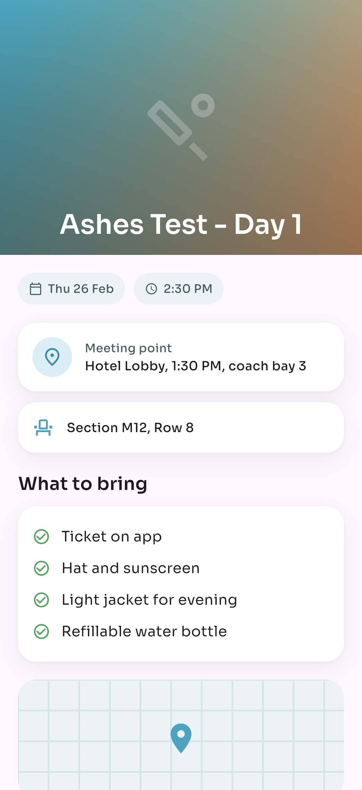 |

| Hotels & transfers | Map | Updates |
|---|---|---|
| 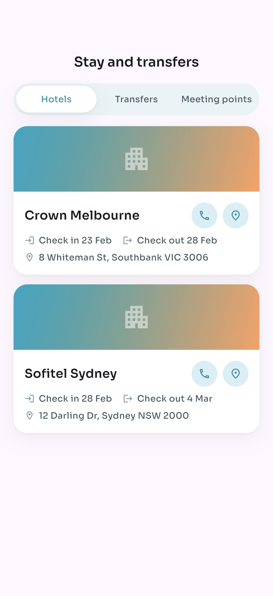 | 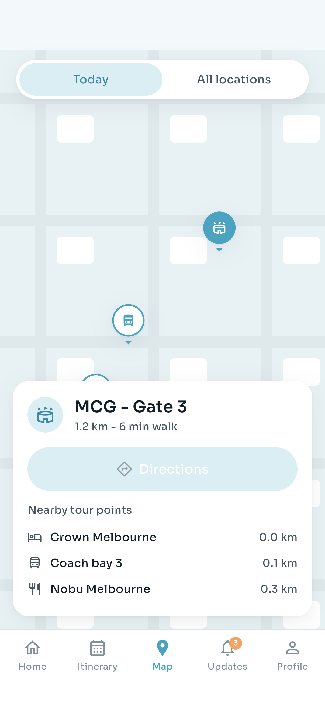 | 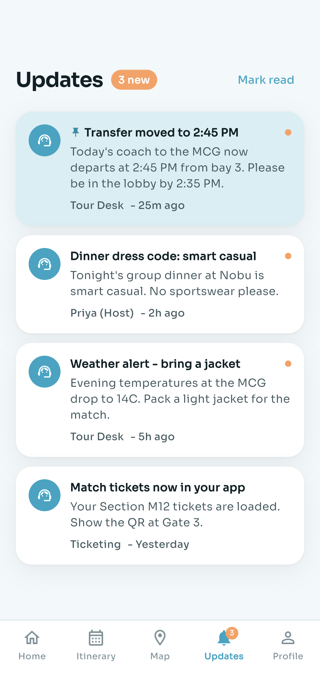 |

| Updates (empty) | Profile |
|---|---|
| 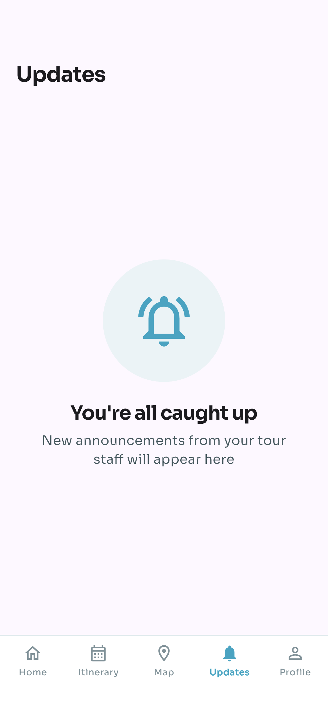 | 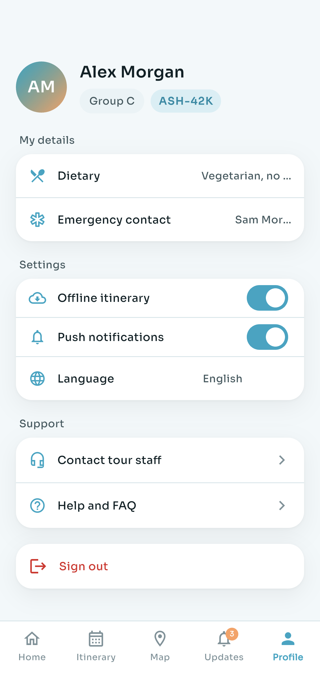 |

## App flow

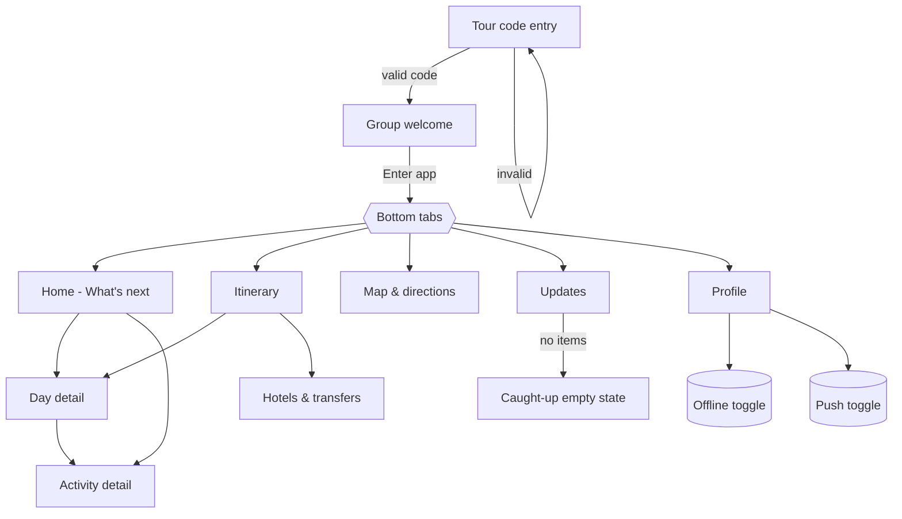

## Architecture

```
lib/
  main.dart              app entry, ProviderScope
  theme/app_theme.dart   design tokens (colors, Sora type scale, radii, shadows)
  models/models.dart     TourGroup, DayPlan, Activity, Hotel, Transfer, UpdateItem, ...
  data/mock_data.dart    Ashes Tour AU 2026 content, tour-code -> group map
  state/providers.dart   Riverpod: tour, offline, notifications, updates + unread count
  widgets/common.dart    shared buttons, cards, chips, tour header
  screens/               the 11 screens (onboarding, tabbed shell, detail pushes)
```

- **State**: Riverpod. `tourProvider` holds the unlocked group; `updatesProvider` is a
  `StateNotifier` exposing the feed and unread count that drives the tab badge.
- **Design system**: one `AppColors` / `AppText` source of truth ported from the Stitch
  `design/DESIGN.md`. Sora font via `google_fonts`. Lagoon-blue accent + sunset support.
- **Navigation**: a five-tab shell (`Home, Itinerary, Map, Updates, Profile`) with detail
  screens pushed on top (no tab bar), matching the design's nav model.
- **Offline-first framing**: content is bundled, so the app is demoable with no signal; the
  "Offline ready" pill reflects the cached itinerary.

## Run

```sh
flutter pub get
flutter run -d "iPhone 17 Pro"
```

Enter tour code `ASH-42K` (pre-filled) and tap Continue.
